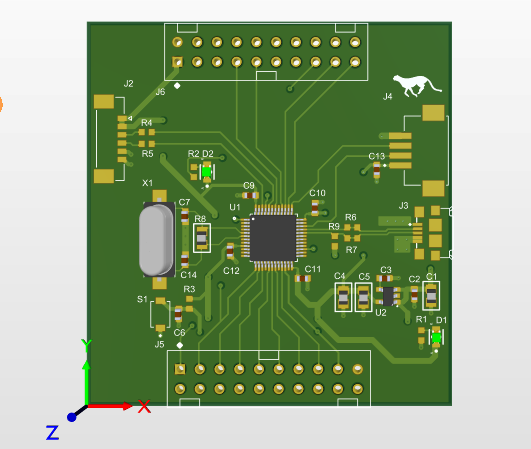

# Custom STM32F103 Board For Low Range, Low Voltage Applications 

## Project Description

This project Designed by Altium Designer Software, it involves the design and development of a customized STM32F103 board "Blue Pill" used on the Blue Pill HUB Card.It is suitable for embedded systems. It is a complete board with an MCU STM32F103C8T6, crystal oscillator (Xtal), Micro USB interface, serial wire debug, and strapping pins. The board is designed to meet specific application requirements and can serve as a foundation for various embedded systems projects. Moreover, it's designed to encourage innovation and objects that are smarter and more aware.

## Table of Contents

1. [Features](#features)
2. [Requirements](#requirements)
3. [Installation](#installation)
4. [Usage](#usage)
5. [Contributing](#contributing)
6. [Troubleshooting](#troubleshooting)
7. [License](#license)
8. [Contact Information](#contact-information)
9. [Acknowledgments](#acknowledgments)

## Features

- Customized STM32f103 microcontroller board.
- Integrated crystal oscillator for precise clocking.
- Micro USB interface for data communication and power supply.
- Serial wire debug support for debugging and programming.
- Strapping pins for configuration and customization.

## Requirements

Blue Pill HUB Board , You can download STM32CubeIDE for configuration as well as implementation of code / ideas. 

## Installation

STM32CubeIDE integrates STM32 configuration and project creation functionalities from STM32CubeMX to offer all-in-one tool experience and save installation and development time. After the selection of an empty STM32 MCU or MPU, or preconfigured microcontroller or microprocessor from the selection of a board or the selection of an example, the project is created and initialization code generated. At any time during the development, the user can return to the initialization and configuration of the peripherals or middleware and regenerate the initialization code with no impact on the user code.

## Usage

The Custom STM32f103 Board is a versatile platform that can be used in various embedded systems and electronics projects. To get started with using the board, follow these general steps:

1. **Hardware Connection**: Connect the Custom STM32f103 Board to your computer or power source using the Micro USB interface. Ensure that you have the necessary power supply if USB power alone is insufficient for your application.

2. **Firmware Development**: Develop your custom firmware or application code using an integrated development environment (IDE) such as [STM32CubeIDE](https://www.st.com/en/development-tools/stm32cubeide.html) or [PlatformIO](https://platformio.org/). Write and compile your code, taking advantage of the STM32f103 microcontroller's features and peripherals.

3. **Programming**: Use a suitable programming tool or debugger (e.g., [ST-Link](https://www.st.com/en/development-tools/st-link-v2.html)) to upload your firmware to the Custom STM32f103 Board. Ensure that the board is correctly configured for programming mode.

4. **Testing and Debugging**: Test your application on the board, monitoring its behavior and performance. Utilize the serial wire debug (SWD) support for real-time debugging and troubleshooting as needed.

5. **Customization**: Leverage the strapping pins to configure and customize the board's functionality to suit your specific project requirements. These pins can be used for various purposes, including setting different operating modes or connecting external components.

6. **Integration**: Incorporate the Custom STM32f103 Board into your project, connecting sensors, actuators, or other peripherals as necessary. Ensure that your hardware connections are secure and reliable.

7. **Documentation**: Document your project thoroughly, including circuit diagrams, pin mappings, and code explanations, to aid in future development and troubleshooting.

Remember that the exact usage and steps may vary depending on your specific project and application. Refer to the documentation provided with the STM32f103 microcontroller and the tools you are using for more detailed instructions.

Feel free to explore the STM32f103's capabilities, experiment with different configurations, and innovate in your embedded systems projects using the Custom STM32f103 Board as your development platform.

## Contributing

Contributions for this dev design is welcome where new idea's are encourged. 
## Troubleshooting
To generate a testing code for your STM32 Blue Pill PCB board, you can use the STM32CubeIDE, which is an integrated development environment for STM32 microcontrollers. It provides a graphical way to configure the microcontroller and generate the initialization code. Here are the steps:

Download and Install STM32CubeIDE:

Download STM32CubeIDE from the official STMicroelectronics website.
Install STM32CubeIDE on your computer.
Create a New STM32 Project:

Open STM32CubeIDE.
Click on "File" > "New" > "STM32 Project."
Select your target STM32 microcontroller (for Blue Pill, it's likely an STM32F1 series).
Choose a project name and location.
Click "Finish."
Configure Project Settings:

In the "Pinout & Configuration" tab, configure your GPIO pins for testing. For example, if you want to toggle an LED on the Blue Pill, configure a GPIO pin as an output.
Generate Code:

Click on the "Project" menu and select "Generate Code."
Write Testing Code:

Open the generated code in the Src folder.

Find the main.c file.

Write your testing code inside the while (1) loop. For example, if you want to toggle an LED, you can use something like this:

/* USER CODE BEGIN WHILE */
while (1)
{
  HAL_GPIO_TogglePin(GPIOA, GPIO_PIN_5); // Toggle LED on GPIOA Pin 5
  HAL_Delay(1000); // Delay for 1 second
}
/* USER CODE END WHILE */

## License
N/A

## Contact Information
eemahdis@gmail.com

## Acknowledgments

AA.
